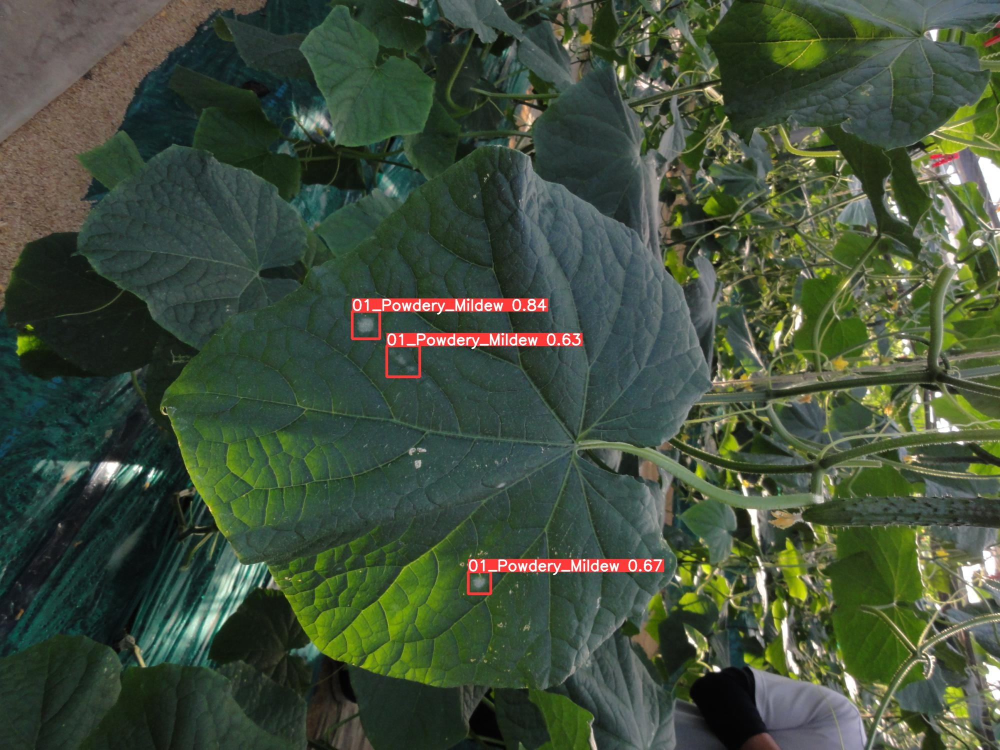
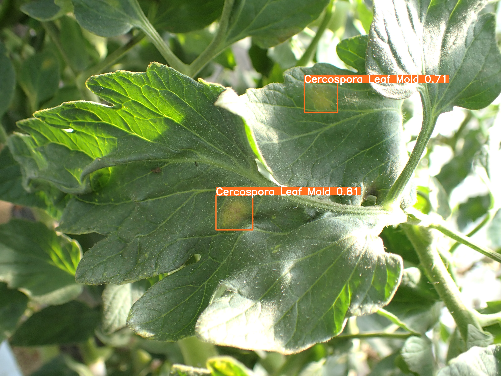

This repository is for training/testing plant (tomato, eggplant, cucumber, etc.) detection.



## Requirements

Python 3.8 or later with all [requirements.txt](https://github.com/IyatomiLab/yolov5_plant/blob/master/requirements.txt) dependencies installed, including `torch>=1.7`. To install run:
```bash
$ pip install -r requirements.txt
```


## Tutorials

* Train Custom Plant Data (Coming soon) &nbsp;🚀 RECOMMENDED
* [Weights & Biases Logging](https://github.com/ultralytics/yolov5/wiki/Train-Custom-Data)&nbsp; 🌟 NEW
* [Multi-GPU Training](https://github.com/ultralytics/yolov5/issues/475)
* [PyTorch Hub](https://github.com/ultralytics/yolov5/issues/36)&nbsp; ⭐ NEW
* [ONNX and TorchScript Export](https://github.com/ultralytics/yolov5/issues/251)
* [Test-Time Augmentation (TTA)](https://github.com/ultralytics/yolov5/issues/303)
* [Model Ensembling](https://github.com/ultralytics/yolov5/issues/318)
* [Model Pruning/Sparsity](https://github.com/ultralytics/yolov5/issues/304)
* [Hyperparameter Evolution](https://github.com/ultralytics/yolov5/issues/607)
* [Transfer Learning with Frozen Layers](https://github.com/IyatomiLab/yolov5_plant/issues/1314)&nbsp; ⭐ NEW


## Environments

YOLOv5 may be run in any of the following up-to-date verified environments (with all dependencies including [CUDA](https://developer.nvidia.com/cuda)/[CUDNN](https://developer.nvidia.com/cudnn), [Python](https://www.python.org/) and [PyTorch](https://pytorch.org/) preinstalled):

- **Google Colab and Kaggle** notebooks with free GPU: <a href="https://colab.research.google.com/github/IyatomiLab/yolov5_plant/blob/master/tutorial.ipynb"></a> <a href="https://www.kaggle.com/IyatomiLab/yolov5_plant"></a>
- **Google Cloud** Deep Learning VM. See [GCP Quickstart Guide](https://github.com/ultralytics/yolov5/wiki/GCP-Quickstart)
- **Amazon** Deep Learning AMI. See [AWS Quickstart Guide](https://github.com/ultralytics/yolov5/wiki/AWS-Quickstart)
- **Docker Image**. See [Docker Quickstart Guide](https://github.com/ultralytics/yolov5/wiki/Docker-Quickstart) <a href="https://hub.docker.com/r/IyatomiLab/yolov5_plant"></a>


## Inference

### On GPU
detect.py runs inference on a variety of sources and saving results to `runs/detect`.
```bash
$ python detect.py  --source /path/to/image/file  # image \
                    --weights /path/to/trained_model.pt # weights \
                    --img-size image_size (optional)
```

### On CPU (for plant server)
Need to run the inference_cpu.py.
```bash
$ python inference_cpu.py  --source /path/to/image/file  # image \
                    --weights /path/to/trained_model.pt # weights \
                    --img-size image_size (optional)
```

For example:
```bash
$ python inference_cpu.py --source cucumber_test.JPG --weights cucumber_yolov5.pt --img-size 1472
```
## Training

First, we need to prepare the training data as YOLO format. Then, just train the model.
It's recommended to fine-tune with a pre-trained model.

```bash
$ python train.py   --img max_img_size  # image size \
                    --batch batch_size # batch size \
                    --epochs num_epoch # number of epoch \
                    --data path/to/yaml # YAML config file \
                    --weights path/to/pretrained/weight # fine-tune from pre-trained
                    --name exp_name # name of experiment (optional)
```
For example:
```bash
$ python train.py --img 1472 --batch 32 --epochs 30 --data cucumber_9class.yaml --weights yolov5x.pt --name cucumber_exp1
```
## Resume training

If your training crashed, run the following command to resume.

```bash
$ python train.py   --resume model_path  # path to model you want to resume from
```
For example:
```bash
$ python train.py --resume /data/yolov5/train/cucumber_det/weights/last.pt
```

## References

[](https://zenodo.org/badge/latestdoi/264818686)

Check out the original YOLOv5 repository for more: [https://github.com/ultralytics/yolov5](https://github.com/ultralytics/yolov5)